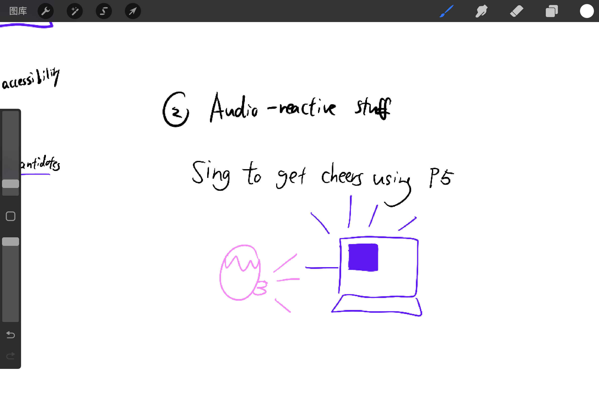
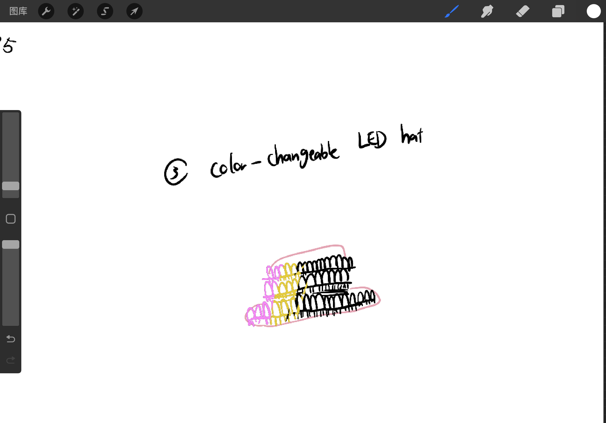

For starters, I looked into the projects online. I keep the research sources here: https://pepper-minute-d06.notion.site/Week-11-db2a3223915546ea96b4f5be9b1ca038?pvs=4   
  
## 1. The Anxiety keyboard
Inspired by the breathing project, I want to create projects that can reflect one's physical movements. The first idea I have is a mini keyboard. 

Input: physical
  
Output: p5
  
The user can click the keyboard when they feel anxious. I got the idea becuase when I feel like stucking in the moment, I like having something near me to click. The p5 can either generate random art or random inspirational notes.


## 2. The audio reative device 

Inspired by the audio examples I saw, maybe I could do a physical device to control both the shape and audio on p5. 
Input: physical  
  
Output: p5
  

## 3. A LED color-changing hat

Input: physical  
  
Output: p5 
  
Inspired by Adobe's real-time interactive dress (https://people.com/adobe-debuts-interactive-dress-8358152), I thought of combining fashion and intereactive visuals. The barrier I can think of for now is the amount of LEDs to make a big project and how can one Arduino chip hold that. Also, what can p5 do in this case? 


# p5.js Template

This is a README file that can be used to describe and document your assignment.

Markdown Cheatsheet (from [https://www.markdownguide.org/cheat-sheet/](https://www.markdownguide.org/cheat-sheet/)):

---
---

# Heading1
## Heading2
### Heading3
#### Heading4
##### Heading5
###### Heading6

**bold text**

*italicized text*

~~strikethrough text~~

Ordered List:
1. First item
2. Second item
3. Third item

Unordered List:
- First item
- Second item
- Third item

`short code block`

```
extended code block
fun() {
  return 0
}
```

Link:  
[linked text](https://www.example.com)


Image with url:  


Image on repo:  


To start a new line, add two spaces at the end of a line, like this:  
this is a new line.


To start a new paragraph, leave an empty line between two lines of text.

This is a new paragraph.
