# Week 2
This week, I put my efforts on how to make the serial connection. I started by learning the Serial tutorial. In the meantime, I added more research into the documentation - Idea 1 Development (https://pepper-minute-d06.notion.site/Week-11-db2a3223915546ea96b4f5be9b1ca038?pvs=4). I learned examples on creating physical keyboards and began thinking do I need a final real keycap.

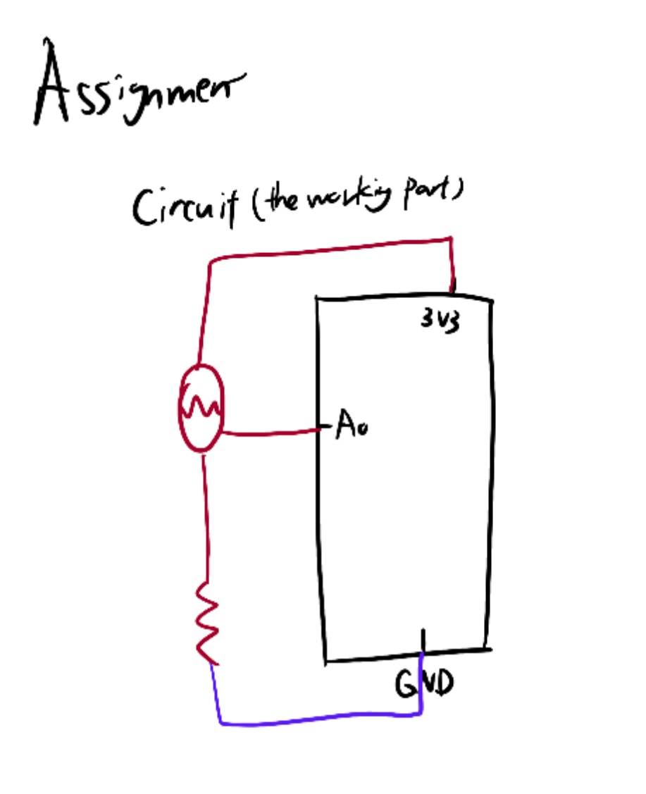
I tried to follow the tutorial to try out the connection itself. In the process, I encountered bugs like don't have the serial monitor on at the same time of using the browser. 

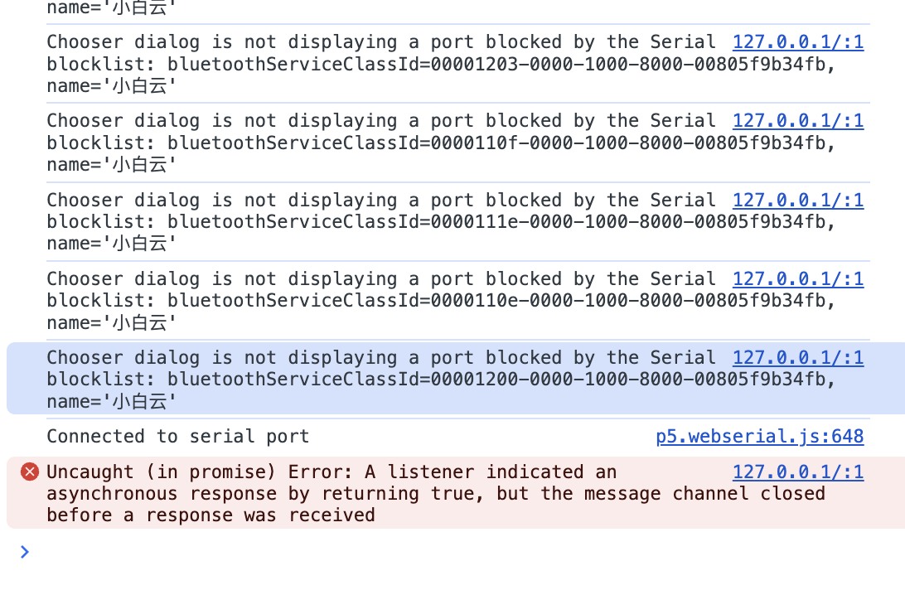

After the successful connection, I wanted to build visuals that would inspire the final idea of releasing anxiety. I love butterflies and the metaphor they represent lately. I wrote circles which sizes are controlled by the photosenser to form the wings of butterflies. Here's the effect:
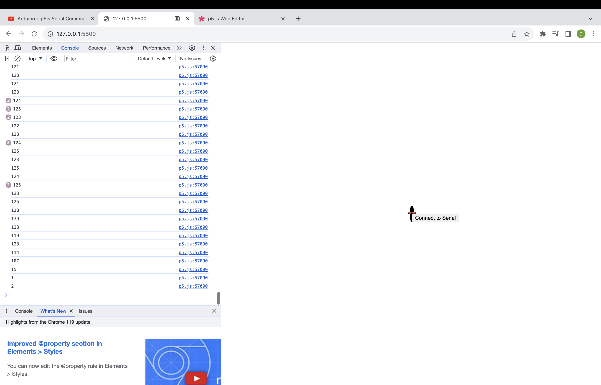
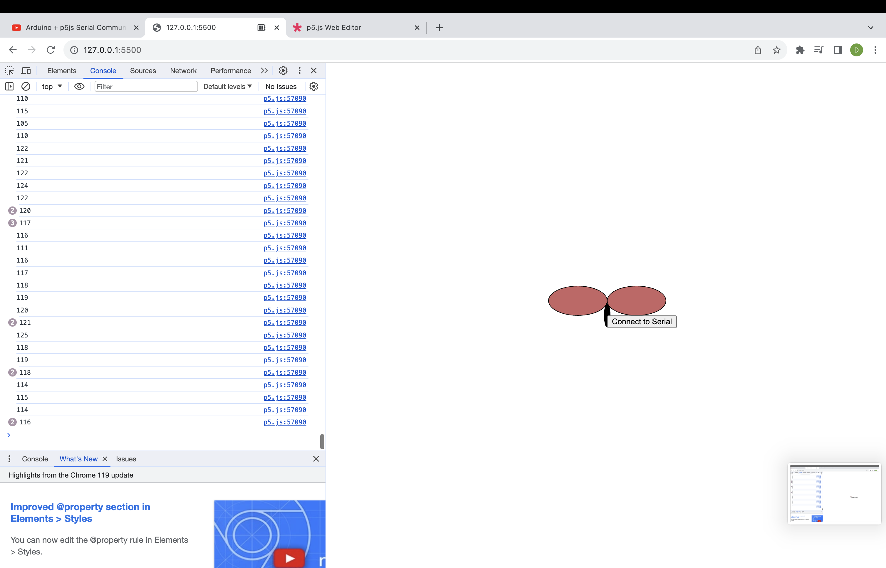

It looked pretty ugly. 
  
So, I drew a previz on colorful circles and squares to spread out the space instead of crawling in the center. 
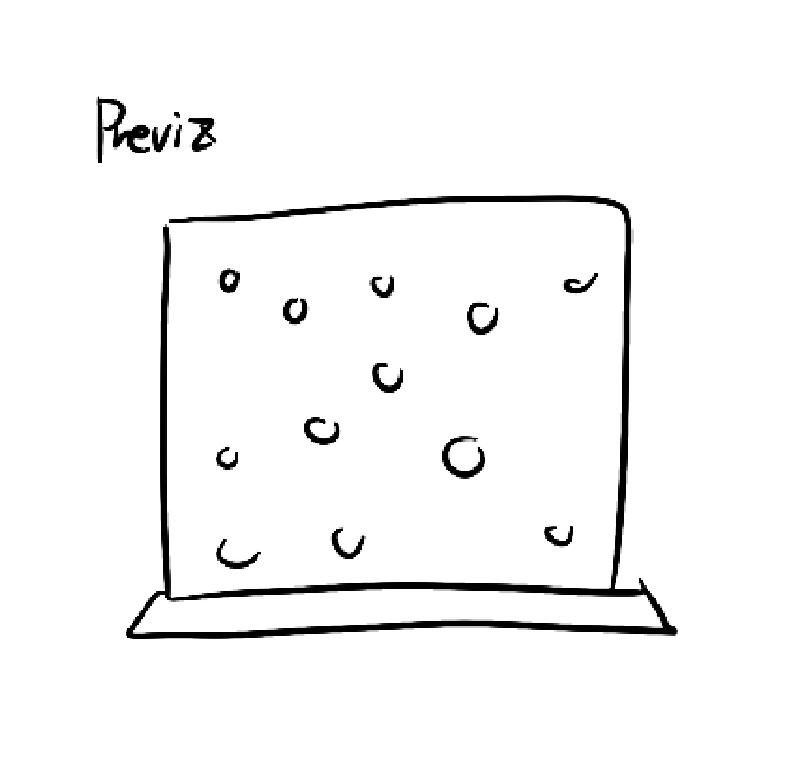

By creating a circle array and a rectangle array, I put all shapes in a uniform, random position that responded to the amount of light detected. A vivid, inspiring image would be adjustable by playing with the photosensor. I like the pixel art feeling it created. 
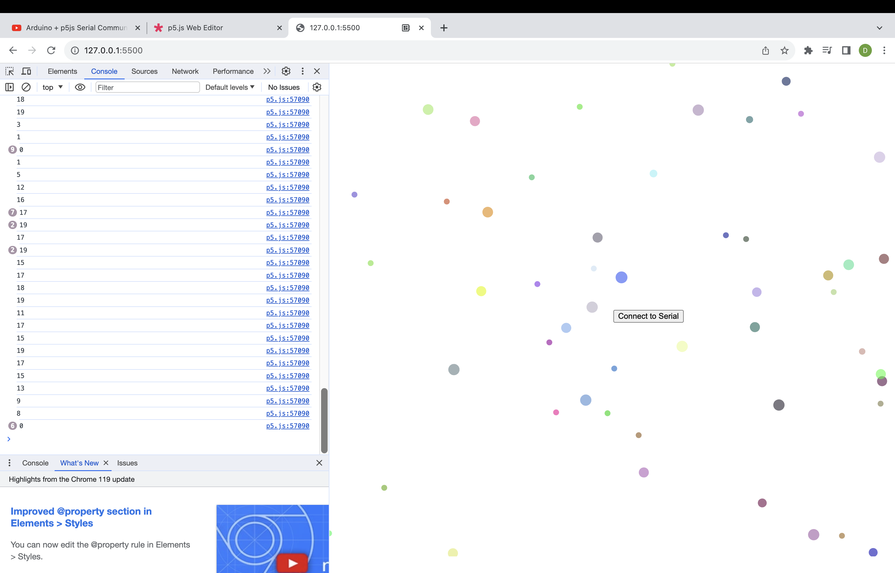
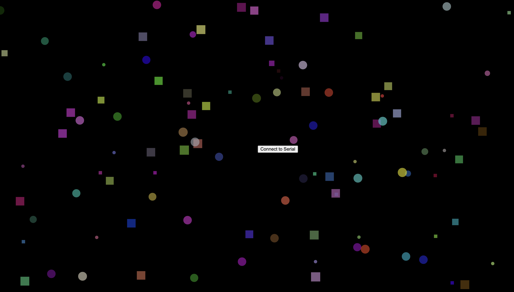


# Milestone 2
### System Diagram
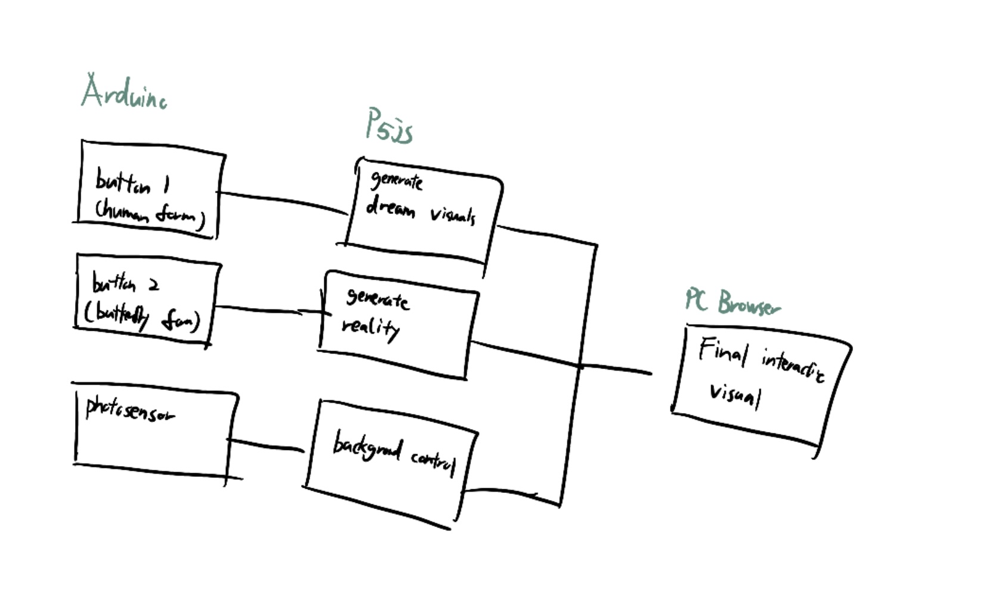

### Circuit Diagram & Outlook
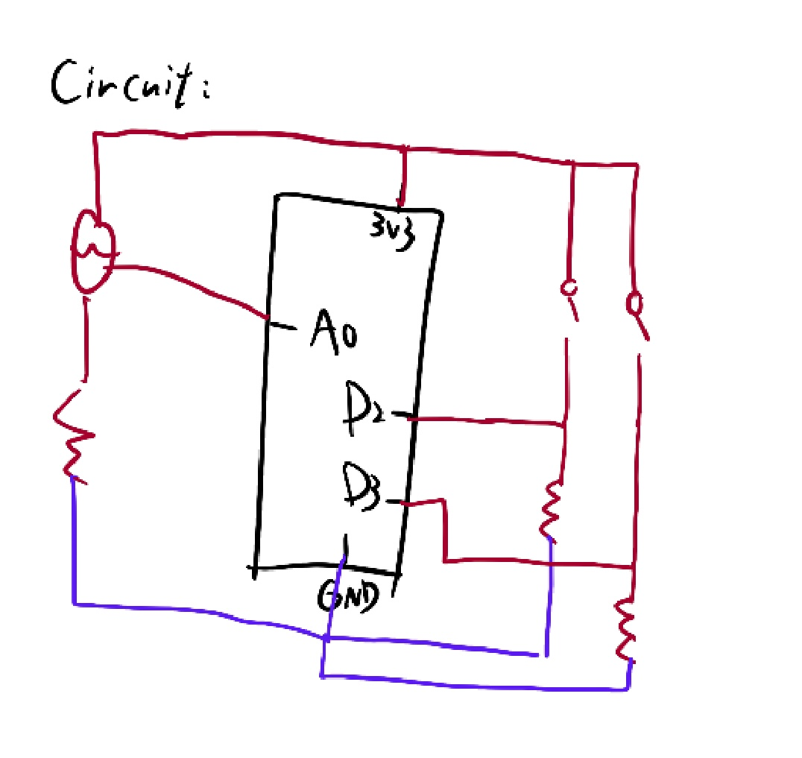
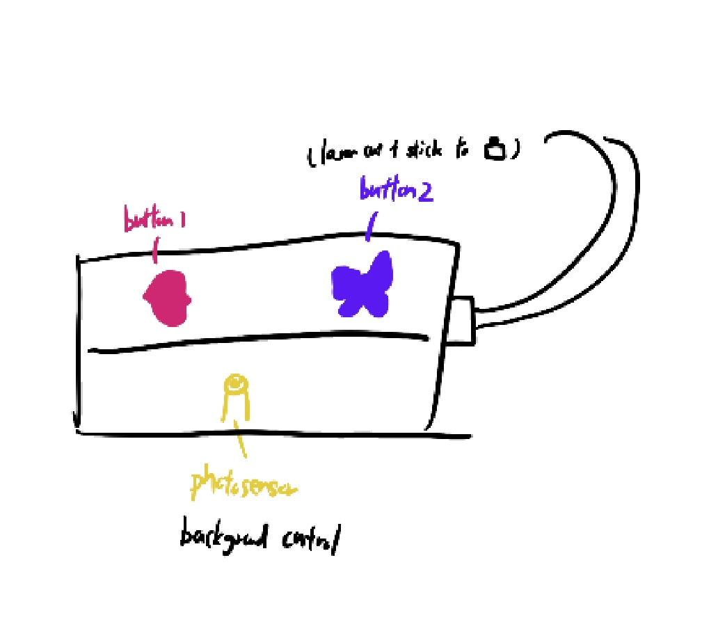

### Planned Mechanism & Relation to Readings
The plan is to recreate a metaphor I like: butterfly and human beings.The story of "庄周梦蝶" (Zhuangzi's Butterfly Dream) is a metaphorical narrative where the philosopher Zhuangzi dreams of being a butterfly, experiencing the world through its perspective. Upon waking, he questions the nature of reality, pondering whether he is a man who dreamt of being a butterfly or a butterfly dreaming of being a man. The metaphor underscores the philosophical concept of the relativity of perception and challenges the certainty of objective reality.
  
The mechanism, like stated in the system diagram, would be:
  
1. Visual language of reality is generated when the "butterfly" button is pressed
2. Visual language of dreams is generated when the "human" button is pressed
3. photosensor detects change of light to decide the overall statement of the blend of reality and dream
  
Of all the readings we read, I felt that the evolution of technology and visual language use the power of media to render a new reality that we all share. We face the decrease of reality every day, and the digital environment we live in seems equal to all, but is controlled by those who own power. While we live around information, the boundary of reality and dreams become even more vague. My original idea was only an anxiety-release button, but with the concept I would explore the boundary of our life and our dreams. 


### Reference images, texts and projects
(https://pepper-minute-d06.notion.site/Week-11-db2a3223915546ea96b4f5be9b1ca038?pvs=4)

### Plan for user testing
I planned to have my roommates test the quality and impression of the p5 visuals and explore their feedbacks. 

### Influences 
1. how does it connected to society?
For the project, I started from the idea of relieving anxiety by having buttons to press. The project would help people relieve certain pressure by physical movements in the time of increased anxiety among various age groups. 

2. why is it important to you?
Like I said above, the readings we have read on de-capitalism and the power of media and visual language made me think of the boundary of reality and dreams. 

### Possible Extended Libraries
I might use any library that would help me create the texture of reality (maybe I'll use camera).
  

# Week 1
For starters, I looked into the projects online. I keep the research sources here: https://pepper-minute-d06.notion.site/Week-11-db2a3223915546ea96b4f5be9b1ca038?pvs=4   
  
## 1. The Anxiety keyboard
Inspired by the breathing project, I want to create projects that can reflect one's physical movements. The first idea I have is a mini keyboard. 
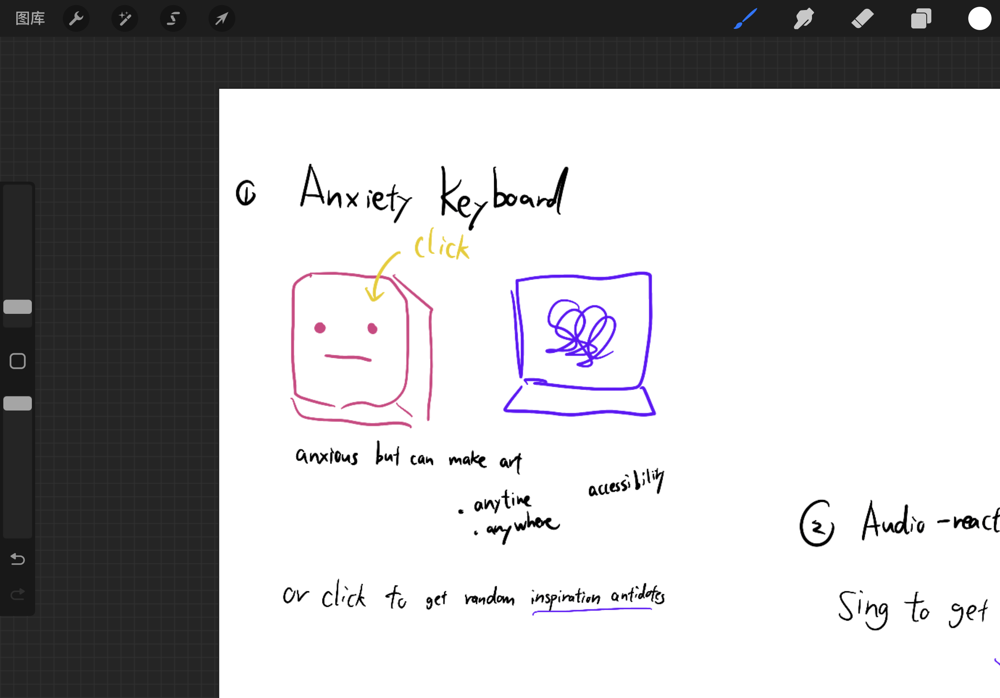
Input: physical
  
Output: p5
  
The user can click the keyboard when they feel anxious. I got the idea becuase when I feel like stucking in the moment, I like having something near me to click. The p5 can either generate random art or random inspirational notes.


## 2. The audio reative device 

Inspired by the audio examples I saw, maybe I could do a physical device to control both the shape and audio on p5. 
Input: physical  
  
Output: p5
  

## 3. A LED color-changing hat
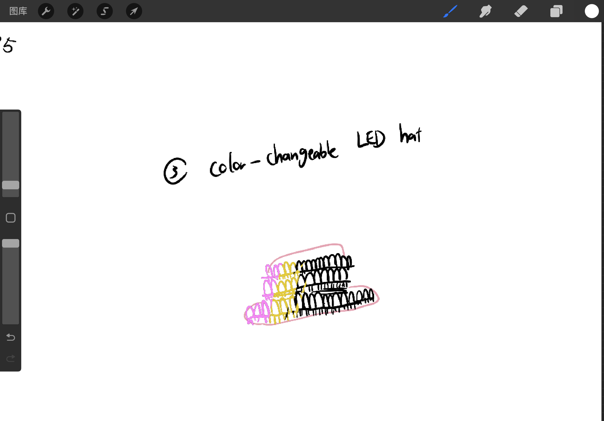
Input: p5
  
Output: physical
  
Inspired by Adobe's real-time interactive dress (https://people.com/adobe-debuts-interactive-dress-8358152), I thought of combining fashion and intereactive visuals. The barrier I can think of for now is the amount of LEDs to make a big project and how can one Arduino chip hold that. Also, what can p5 do in this case? 


# Milestone 3
Based on the former weeks' sketch, I worked on the background control and testing the dream layer this week using the photoresistor. 
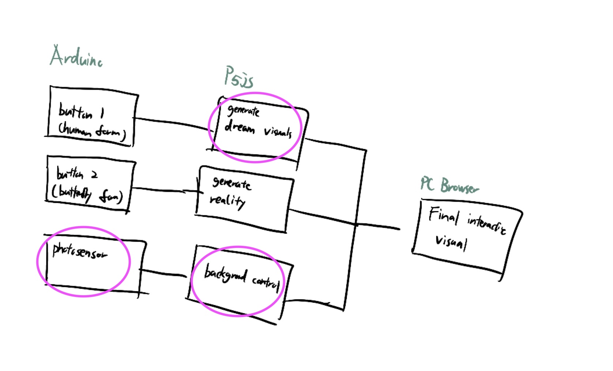

I used the same circuit from last time, and here's an updated FSM. 

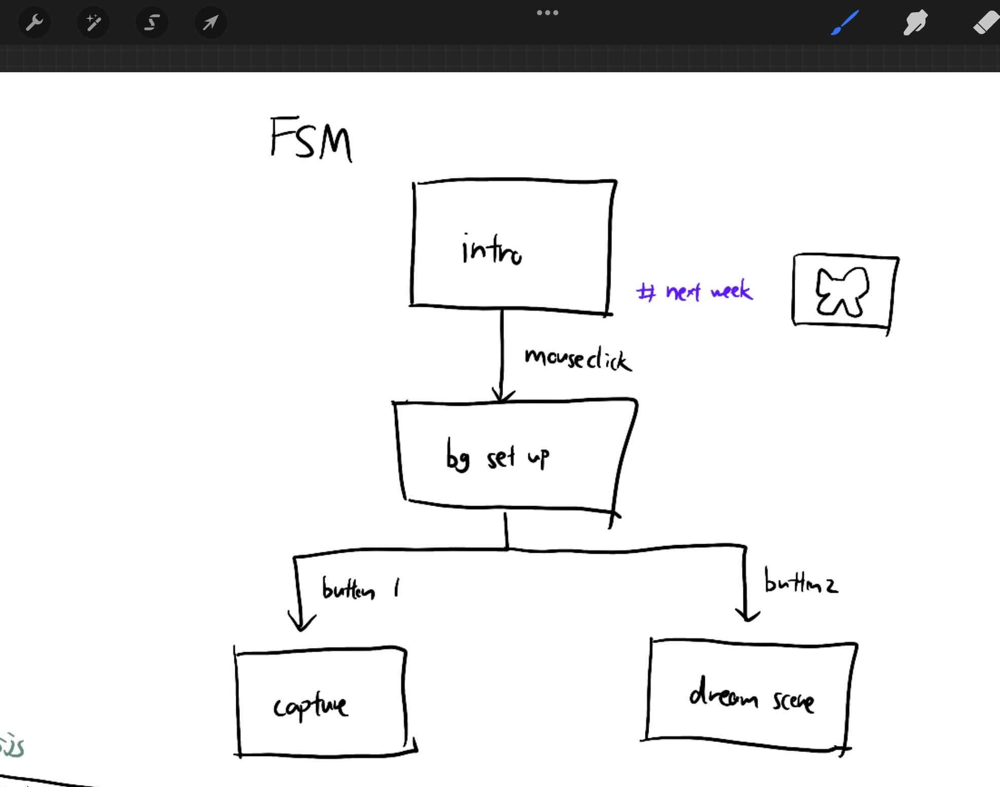

## Development of Background set up
This week, I started from a mood board of how to build a virtual dream scene somehow. I also looked into different reference codes on OpenProcessing (@Richard Bourne) because I want to create this sea-like waves accross the screen. I refered the creation of waves using triangulars and noise().
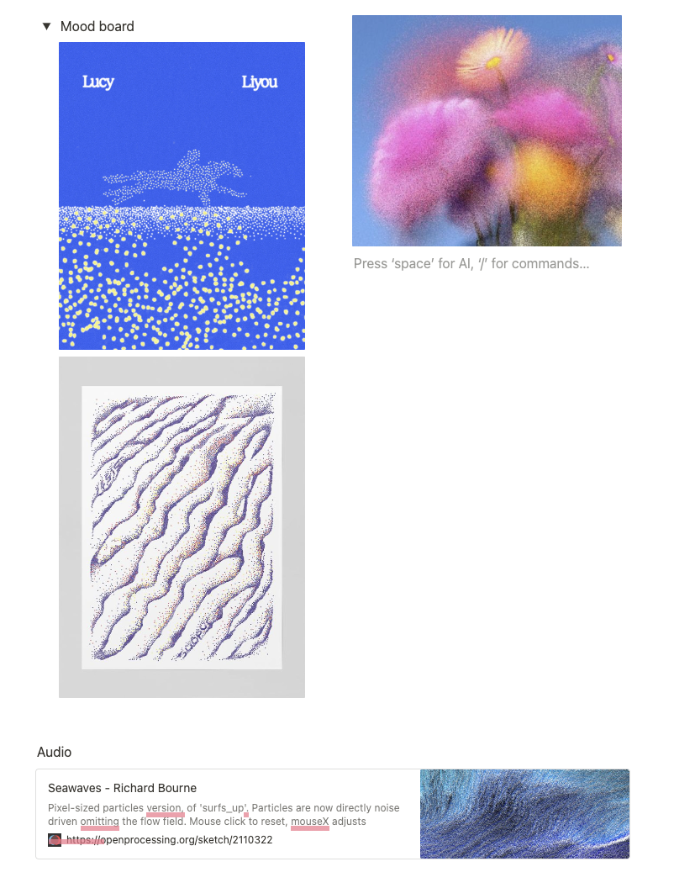
 
 The process was not smooth, but I (we) managed to achieve the desired result. Here are some sketches along the process:
   
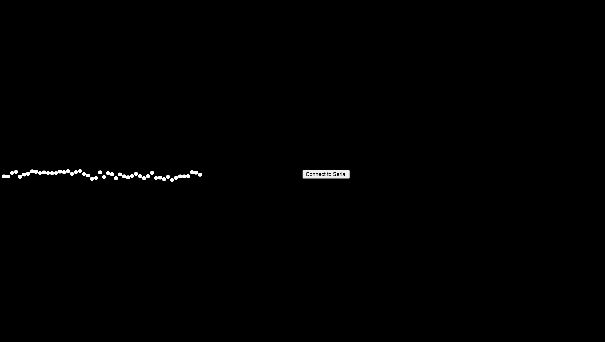
The initial prototype look like this. I found out I myself wasn't ablt to create very delicate designs.
  
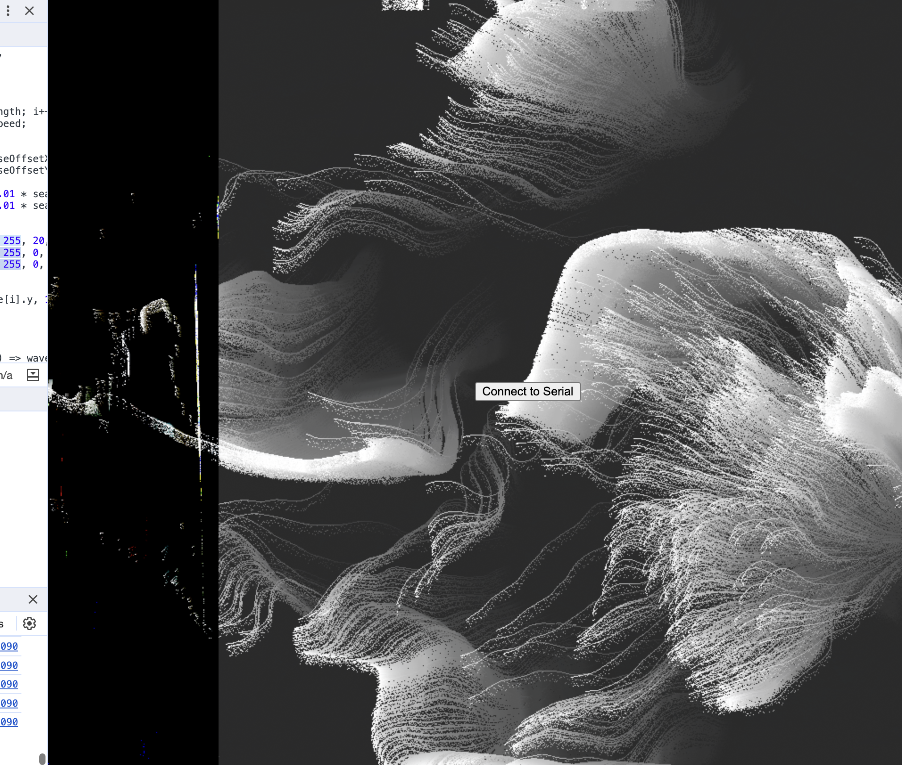
After debugging and creating a parameter for the reading of photoresister, the connection was successful, and now I can use light to control the moving speed of the visuals. 
  
## Development of the Reality Part: Real-time camera
During the time of stucking to debug the connection problem, I began experimenting with the blending of real-time camera with the waves. The initial effect looks like this. I'm trying to create slices of real-time images.
  


## The Rest of the Prompts
You can check the indexes of Milestone 2 for Description of any sensor, output component or mechanism that you are planning on using or building, Reference images, texts and projects, Plan for user testing, and Short discussion of why your project is relevant. I'm still on the track of the original plan. 


# p5.js Template

This is a README file that can be used to describe and document your assignment.

Markdown Cheatsheet (from [https://www.markdownguide.org/cheat-sheet/](https://www.markdownguide.org/cheat-sheet/)):

---
---

# Heading1
## Heading2
### Heading3
#### Heading4
##### Heading5
###### Heading6

**bold text**

*italicized text*

~~strikethrough text~~

Ordered List:
1. First item
2. Second item
3. Third item

Unordered List:
- First item
- Second item
- Third item

`short code block`

```
extended code block
fun() {
  return 0
}
```

Link:  
[linked text](https://www.example.com)


Image with url:  


Image on repo:  


To start a new line, add two spaces at the end of a line, like this:  
this is a new line.


To start a new paragraph, leave an empty line between two lines of text.

This is a new paragraph.
